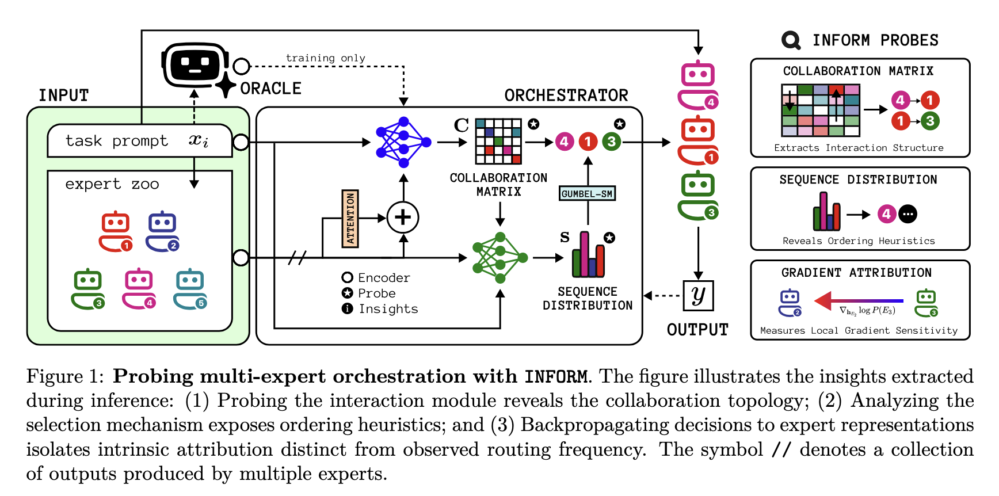

# Disentangling Intrinsic Importance from Emergent Structure in Multi-Expert Orchestration

Accepted by **Transactions on Machine Learning Research (TMLR)**

**OpenReview:** https://openreview.net/forum?id=4W7sgat04A



## Setup

Install all dependencies using the following command:

```bash
$ pip install -r requirements.txt
```

Replace all placeholder values like `BASE_URL`, `API_KEY` with your own values, across all files.

## Directories

The source code is organized in the following directories:

- `ablations`
- `analysis`
- `eval`
- `plotting`
- `src`

## Training

Running the following script will produce artifcats in the `checkpoints` folder:

```bash
$  python src/train.py
```

---

## Citation

If you find this work useful in your research, please consider citing:

```bibtex
@article{
      ghosh2026disentangling,
      title={Disentangling Intrinsic Importance from Emergent Structure in Multi-Expert Orchestration},
      author={Sudipto Ghosh and Sujoy Nath and Sunny Manchanda and Tanmoy Chakraborty},
      journal={Transactions on Machine Learning Research},
      issn={2835-8856},
      year={2026},
      url={https://openreview.net/forum?id=4W7sgat04A}
}
```
---
